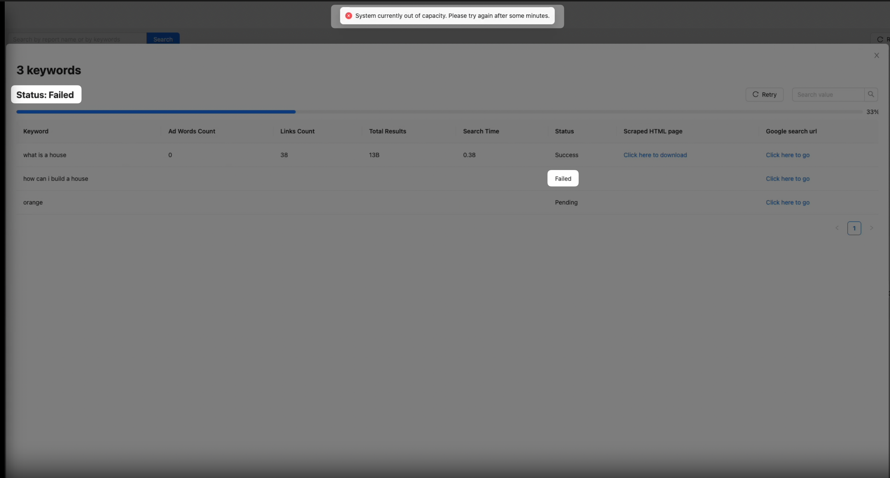

# Nimble scraper

## Index tree
- [Nimble scraper](#nimble-scraper)
  - [Index tree](#index-tree)
  - [Demos](#demos)
  - [Links](#links)
  - [Code structures](#code-structures)
    - [Backend(Rails)](#backendrails)
      - [Structure](#structure)
      - [Libraries](#libraries)
    - [Frontend(React)](#frontendreact)
      - [Structure](#structure-1)
      - [Libraries](#libraries-1)
  - [Obstacles and approaches](#obstacles-and-approaches)
    - [Obstacles](#obstacles)
    - [My approaches](#my-approaches)
    - [Dealing with Selenium's slowness](#dealing-with-seleniums-slowness)
    - [Retry mechanism](#retry-mechanism)
  - [What's left](#whats-left)
  - [Things I will try to do if I still have time left](#things-i-will-try-to-do-if-i-still-have-time-left)

## Demos
- [First MVP 2023-03-19 17:47](https://share.cleanshot.com/bWY03jmP)

## Links
- [Front-end github repo](https://github.com/tednguyendev/nimble_challenge_fe)
- [Postman collection(version 2023-03-19 20:00)](https://api.postman.com/collections/9434315-f930a92c-eb4e-48ee-89ef-8fb53ff49baf?access_key=PMAT-01GVWZ6R79MM3W3JXV76YR3B56)
- [.env file]()
  - TBD

## Code structures
### Backend(Rails)
I choose Rails because it is the framework that I am most familiar with, and I think it is the most suitable for building MVPs like this.

#### Structure
I use a pretty standard structure for this project.

Besides the default folders of Rails like models, controllers, views, ... I also added one `commands` folder to contain the service objects and the added one `presenters` folder to contain the presenters(serializers) files.

#### Libraries
I use:
- Gem `jwt` to encode and decode the JWT token.
- Gem `sidekiq` + `redis` to handle background processing.
- Gem `selenium-webdriver` + `webdrivers` to scrape the Google Search results.
- Gem `rspec-rails` + `shoulda-matchers` + `factory_bot_rails` + `faker` to write the tests.

### Frontend(React)
As a front-end developer, I admit I have limited field experience. However, I have chosen to work with React since it's the framework I'm most comfortable with.

Given my limited experience, I prioritize simplicity in my work. To achieve this, I utilize structures, libraries, and coding styles that I last used over two and a half years ago. Although they may not be the latest standards, they are the ones I am most familiar with. I strive to continually improve my skills and stay up-to-date with the latest trends in front-end development.

#### Structure
I also use a common folder structure for this React project:
- `components`: Reusable UI components for the application.
- `config`: Configuration files needed for the application.
- `layouts`: Files that define how application components are arranged on the page.
- `pages`: High-level views or pages of the application.
- `services`: Connects the application to external services such as APIs.

#### Libraries
I use `axios` to make HTTP requests, `react-router-dom` to handle the routing, and `antd`(Ant Design) to help me build the UI.

## Obstacles and approaches
### Obstacles
As I researched, one of the most popular and most efficient ways to handle the limitations of mass-searching keywords that people usually use are:
- Use the Google Search API
- Use the Google Search Scraping services from third-party services

But as we can not use the third-party services, I then move on to find out if there are any other ways.

Another method I find is to rotate the proxies.

In short, as we send requests to the servers, one of the most basic and most reliable ways the servers can use to rate limit or to prevent DDoS is to detect and limit the requests based on the IP of the clients.

So the most obvious way to bypass this is to not only have one IP, which is to use rotating proxies.

But we can not use any third-party services, including the third-party services that provide the rotate proxies services.

I also discovered other ways to handle the mass-searching problem, but I'm afraid they are still considered third-party services.

As to rotate proxies, using third-party services is not the only way:
- We can create our own proxies to rotate.
- We can scrape sites that provide free rotate proxies, like [this](https://free-proxy-list.net/rotating-proxy-open.html), to have a list of short-lived free-to-use proxies.

Besides that, we can distribute the crawl to multiple machines, and each server can have its own IP.

Another way is to use the headless browser to run the Tor browser - the browser that can help its user browse the internet anonymously without exposing their IP.

These are all the ways that are still very effective in protecting the application from being banned, although not as effective as using rotating proxies or scraping services. But since I think they are still third-party services(creating our own proxies may need tools and servers, using Tor means that we depend on Tor, or distributing the crawl may need more cloud servers ,...), I won't use them. But if they are not and I can use them, please tell me; thank you!

### My approaches
Not as effective as the earlier methods, I figured out that there are still ways to reduce the chance of the application being banned.

If we can not have many IPs, we must be as human as we are when scraping the pages.

The first method is to use random sleep(delay) time.

Between each request to search Google, I put a [randomly generated sleep time](https://github.com/tednguyendev/nimble_challenge/blob/46751b7247c54ed64244474570f41b16326c7c4a/app/commands/api/v1/reports/fetch_keywords.rb#L46) as a mimic of human behaviour.

I also put in a [random sleep time(a bit longer)](https://github.com/tednguyendev/nimble_challenge/blob/46751b7247c54ed64244474570f41b16326c7c4a/app/commands/api/v1/reports/fetch_keywords.rb#L41) between every ten requests, also as a mimic of being a human.

The next method I use is that I have a list of user agents(about 1000 agents), and [I rotate and pick one of them](https://github.com/tednguyendev/nimble_challenge/blob/d6300378d9a0061a8d4c78eeadb93e77208c0289/app/commands/api/v1/reports/fetch_keywords.rb#L116) to use for each request to appear as if we are accessing the site from different devices or browsers.

And the last thing is that [I use the headless browser Selenium](https://github.com/tednguyendev/nimble_challenge/blob/d6300378d9a0061a8d4c78eeadb93e77208c0289/app/commands/api/v1/reports/fetch_keywords.rb#L101), as a headless browser allows us to simulate a web browser without a graphical user interface, which can help us crawl websites more efficiently and avoid detection. Another reason I use Selenium is that these headless browsers can help us scrape the sites that also use JavaScript to render the pages(Like Google).

Of course, these are not foolproof methods to prevent being banned or blocked entirely, but every technique that can help us reduce the chance of being banned is worth implementing.

### Dealing with Selenium's slowness

One area of concern for using the headless browser is its slowness.

To improve this, I also tried to use the Typhoeus to try to crawl, and although I found that it can speed up this process a lot by fetching pages parallelly, doing this faster also means that we are sending more requests to the servers, which also means that we are more likely to be banned(it only took like 4 or 5 CSV file uploads to be rate limited). So just trying to increase the speed of the process without consideration is not a good idea.

My initial approach is to leverage the polling method, which enables the continuous loading and display of information to the user, which ensure prompt updates of the scraped data for each keyword.

Like this,

The scraped information of each keyword row will be shown to the user periodly(I use polling API calls, with 4-second intervals), and although the user will still need to wait for all other keywords to be processed, they can look at the newly updated scraped keyword information row and work on that row first, when waiting for the other keywords to be scraped.

Another method is, instead of asking the user that they have to keep the browser open and to sit there and wait for the result, I tell the user that they do not need to stay, and instead, the Nimble Scraper application will send them a notification email after the whole process is finished.

The note:

The email:

### Retry mechanism

And as the methods I implemented are not foolproof, I also implemented a retry mechanism to retry the scraping process if fails.

Every time Google detects that we are scraping and start preventing us from scraping, the backend will detect that and mark the status of the report and the current scraping keyword as `failed` to show the user that the scraping process is failed.

You can watch the video version [here](https://share.cleanshot.com/sMJlCKQ0).

The user then, after waiting for some minutes(so that Google will ease its rate limiting on us), can click the retry button to retry the scraping process.

If the scraping is available now, it will mark the status of the report and the current scraping keyword back to `pending`, and the process continues.

You can watch the video version [here](https://share.cleanshot.com/NhmTPBR1).

## What's left
- Improve the codebase, make the code cleaner
- Handle more edge cases
- Improve UI-UX
- Deploy the application to `AWS` using `LightSail`
- Keep updating the documentation so that we can communicate asynchronously easier.

## Things I will try to do if I still have time left
- [ ] The HTML cached file
  - [ ] 1. There are some pages that, when scraped, its css is not loaded correctly entirely.
  - [ ] 2. I'm saving the cached HTML file to the database as a text field, which is acceptable for now. But the database is not designed to store large files(The HTML files I'm scraping have around 1 million characters, which is a lot).
    - To solve this, I can store these files to `AWS` `S3` instead, and then when the frontend needs, the backend just need to return the URL of the file, and the frontend can fetch the file from the URL.
- [ ] Solves the captchas when Google detects that we are scraping
- [ ] Localize i18n the texts in the application
- [ ] Add the Admin page to manage the users and the reports